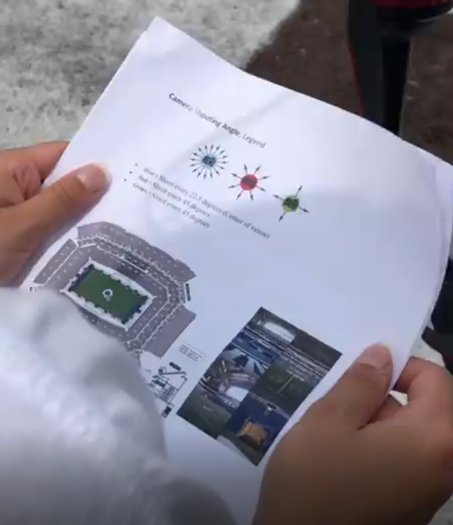
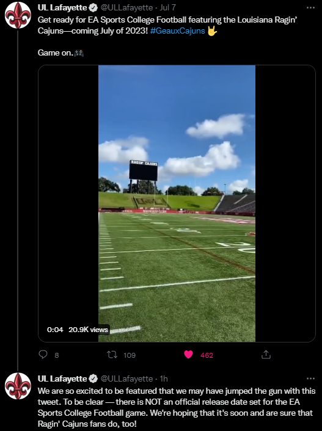
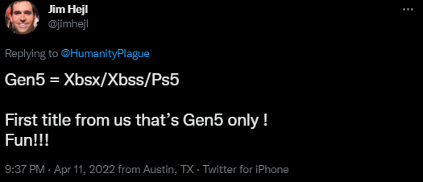
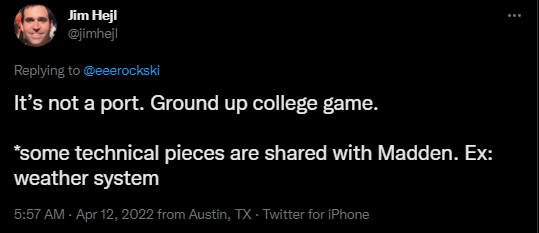
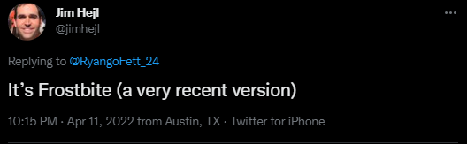
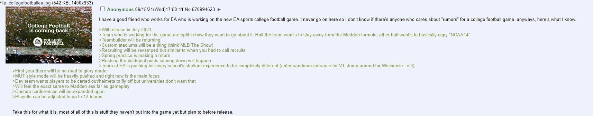

* NOTE: Rumors on here are NOT confirmed as some of these date back to when the game was in an idea stage so not everything is 100% and can be changed when game is released. IF YOU FIND ANY MORE LEAKS DM ME {My twitter: @MiraculousMani}

>Credits:
>
>Matt Brown @ Extra Poitns
>
>u/Thibson50 on Reddit
>
>Bowling Green Instagram
>
>Jim Hejl on Twitter
>
>ULL on Twitter
>

* Confident Rumors (Rumors that are from official college accounts, reputable sources, or developers):

> Bowling Green Athletics Instagram Video
>
>o Desc: Bowling Green Athletics posted a video on July 16, 2021, showing the process to rendering a stadium… in the video we can see the plan EA wanted for the stadiums as well as how the detailed process was
>
>o Link: www.instagram.com/p/CRZ5pMKg7Fp/?utm_source=ig_web_copy_link
>
>o Images:
>
>
>
>
-----------------------------------------------------------------------------------------------------------------------------------------------------------------------

> Matt Brown FOIA 
> 
>o Desc: Matt Brown, a reputable journalist put out FOIA requests in hopes to find out details on the new college football game. What he recieved was the following:
>
> - Game Expected to come out July 2023
> - Game Development is in full force
> - EA is trying to obtain audio assets such as Band Songs, Crowd Chants, and Cheers and specific audio that is played during your teams game
> - EA is also looking for Spirit stickers such as Ohio State as an example
> - Remaining holdouts not officialy in the game have still provided stadium and audio assets
> - EA is trying to obtain player likenesses through group licensing
> - Schools that are participating are being paid through a tier system based on AP polls.
>
>o Link: https://www.extrapointsmb.com/heres-everything-i-know-about-ea-sports-college-football-with-updated-info/
-----------------------------------------------------------------------------------------------------------------------------------------------------------------------

> ULL Tweets
> 
>o Desc: UL Lafayette on twitter tweeted out stadium renderings and in the first tweet CONFIRMED the 2023 July Release Date, however a following tweet
> that was posted days later (Probably an EA move telling them it is not official) announced that it was not official. 
>
>o Links: https://twitter.com/ULLafayette/status/1545121942889500673 ; https://twitter.com/ULLafayette/status/1546961710111760384 
> 
>o Images:
>
>

> Developer Jim Hejl Tweets
> 
>o Desc: Jim Hejl started working on the CFB game on April 4th, following that he answered many questions in the replies about the game. The replies answered confirm that:
>
> - THE GAME IS GEN5 ONLY (PS5/Xbox Series X and S)
> 
> - Game is being built from the ground up.. not a port
> 
> - Only some technical features were copied from Madden such as the weather system
> 
> - Game engine is Frostbite (:P) but a very recent version
> 
>o Links: https://twitter.com/jimhejl/status/1513738011581812741 ; https://twitter.com/jimhejl/status/1513863883991269381 ; https://twitter.com/jimhejl/status/1513747706174480388
> 
>o Images:
>
>
>
>

* Semi-Confident Rumors (Rumors from Sources that come from social media with a somewhat good track record/others I sort of believe in):

* Rumors (Regular Rumors that don't have much backing):

> 4Chan Anonymous Post
> 
>o Desc: 4Chan Anonymous user posted the information he recieved from his friend developer about the game. Some of the information has so far been looking accurate, nevertheless here it is (NOTE THIS IS FROM 2021 SO COULD CHANGE):
>
> - Game will release in July 2023
> 
> - Dev Team split with half wanting to stay away from being a madden clone and half of them wanting to basically "copy" Ncaa 14
> 
> - Teambuilder returning
> 
> - Custom stadiums like MLB The Show
> 
> - Recruiting revamped but will be like call recruits (Similar to Ncaa 13??? idk)
> 
> - Spring Practice is returning
> 
> - Rushing the field and the goal posts coming down is confirmed.
> 
> - Custom stadiums like MLB The Show
> 
>o Links: (Can't find a link)
> 
>o Images:
>
>
