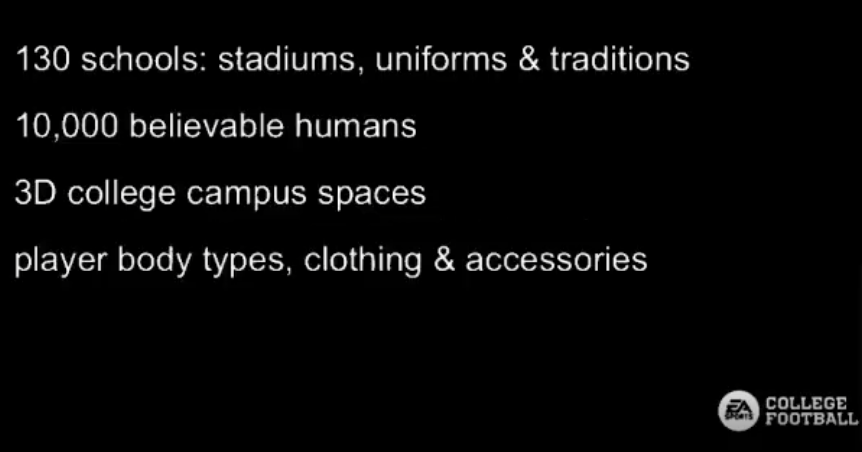

* NOTE: Rumors on here are NOT confirmed as some of these date back to when the game was in an idea stage so not everything is 100%

* Confident Rumors (Rumors that are from official college accounts, reputable sources, or developers):

> Bowling Green Athletics Instagram Video
o Desc: Bowling Green Athletics posted a video on July 16, 2021, showing the process to rendering a stadium… in the video we can see the plan EA wanted for the stadiums as well as how the detailed process was
o Link: www.instagram.com/p/CRZ5pMKg7Fp/?utm_source=ig_web_copy_link
o Images:

* Semi-Confident Rumors (Rumors from Sources that come from social media with a somewhat good track record/others I sort of believe in):

* Rumors (Regular Rumors that don't have much backing):
